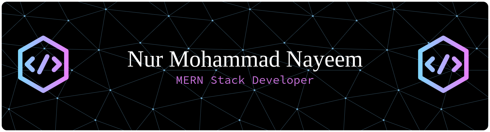

 

<!--- title --->

  <ul align="center">
    
<h1 style="display: inline-block">Hi 👋, I'm Nur Mohammad Nayeem</h1>

    <!--- typo --->
    
  </ul>

 

  

---

## 🧑‍💻 About Me

I am a passionate and dedicated **MERN Stack Developer** who loves building modern, scalable, and user-friendly web applications.  
I enjoy solving problems, learning new technologies, and improving my development skills every day.

---

## 🔥 What I'm Currently Doing

- 🔭 Currently Exploring **Next.js and Prisma**
- 🛠️ Currently Working on **Delivery-System MERN Website**
- 👨‍💻 All of my projects are available at [My Portfolio](https://nur-nayeem-portfolio.pages.dev/)
- 💬 Ask me about **React, Node.js, Express, MongoDB**
- 📫 How to reach me: **nurnayem768@gmail.com**
- ⚡ Fun fact: I write cleaner code at 2 AM than at 2 PM — no one knows why, not even me 😄

---

## 🌍 Connect with Me

  

    
    
    
    
  

---

## 🛠️ Tech Stack

### Languages:

### Frameworks & Libraries:

### Database & Model:

### Tools & Technologies:

 

---

## 🚀 Latest Projects

<table>
<tr>

<!-- Project 1 -->
<td width="50%">
<h3>🐾 PawsMart</h3>

PawMart is a modern React-based marketplace for pets and pet-related products, helping pet lovers adopt pets and buy essentials in one place.

<b>Tech:</b> React.js, Node.js, Express, MongoDB

🔗 <a href="https://pawsmart-79833.web.app/">Live Demo</a> • 
💻 <a href="https://github.com/Nur-Nayeem/PawMart-Client-Assignment-10-Programming-Hero">GitHub</a>

</td>

<!-- Project 2 -->
<td width="50%">
<h3>🎨 AI Image Generator</h3>

Transforms text prompts into high-resolution images in various styles using advanced AI.

<b>Tech:</b> React.js, Node.js, Express, MongoDB, Mongoose

🔗 <a href="https://image-gen-422.web.app/" target="_blank">Live Demo</a> • 
💻 <a href="https://github.com/Nur-Nayeem/Ai-Img-gen" target="_blank">GitHub</a>

</td>

</tr>
<tr>

<!-- Project 3 -->
<td width="50%">
<h3>📱 APEX.IO – App Store Website</h3>

A React-based app store where users can browse, search, install, and track installed Android & iOS apps.

<b>Tech:</b> React.js, React-Router

🔗 <a href="https://apex-io-nur-nayeem.pages.dev/" target="_blank">Live Demo</a> • 
💻 <a href="https://github.com/Nur-Nayeem/apex.io-hero.io-assignment-8-programming-hero" target="_blank">GitHub</a>

</td>

<!-- Project 4 -->
<td width="50%">
<h3>❄️ WarmPaws — Pet Service Platform</h3>

A cozy winter companion platform for pet owners to keep their furry friends warm, safe, and healthy.

<b>Tech:</b> React.js, Firebase

🔗 <a href="https://warmpaws-2c2b2.web.app/" target="_blank">Live Demo</a> • 
💻 <a href="https://github.com/Nur-Nayeem/warm-Paws-pet-service-system-assignment-9-programming-hero" target="_blank">GitHub</a>

</td>

</tr>

</table>

# 📊 GitHub Stats:

  

 

  

  

---

## ⚡ Fun Quotes

> "Code is like humor. When you have to explain it, it’s bad."  
> "Stay curious. Stay building."

---
